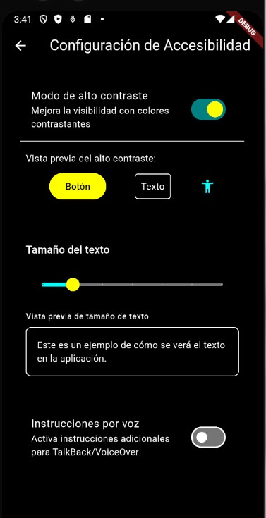
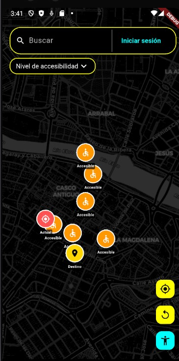
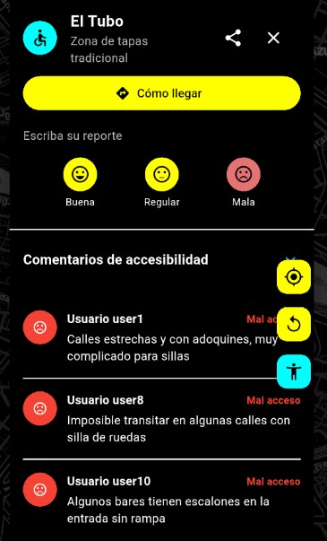

# Índice de Documentación - Barrera Cero

Bienvenido a la documentación de Barrera Cero, la aplicación móvil para mapear y compartir información sobre accesibilidad en espacios públicos.

## Documentación de Desarrollo

### Sprints
- [Sprint 1: Funcionalidades Básicas](sprints/sprint1-funcionalidades_basicas.md) - Implementación del mapa interactivo y sistema de marcadores
- [Sprint 3: Accesibilidad](sprints/sprint3-accesibilidad.md) - Implementación de funciones de accesibilidad (alto contraste, texto ampliable e instrucciones por voz)

### Guías
- [Guía de Pruebas Funcionales](guias/guia_pruebas_funcionales.md) - Instrucciones detalladas para probar las funcionalidades básicas
- [Guía de Pruebas de Accesibilidad](guias/guia_pruebas_accesibilidad.md) - Instrucciones para probar las funcionalidades de accesibilidad

## Capturas de Pantalla

### Funcionalidades de Accesibilidad

<div align="center">
  <figure>
    
    <figcaption>Pantalla de configuración de accesibilidad</figcaption>
  </figure>

  <figure>
    
    <figcaption>Mapa en modo alto contraste</figcaption>
  </figure>

  <figure>
    
    <figcaption>Marcadores con optimización para accesibilidad</figcaption>
  </figure>
</div>

## Estructura del Proyecto

```
barrera_cero/
├── lib/
│   ├── features/
│   │   ├── accessibility/      # Funcionalidades de accesibilidad
│   │   ├── map/                # Funcionalidades del mapa
│   │   └── ...
│   ├── main.dart               # Punto de entrada de la aplicación
│   └── ...
└── docs/                       # Documentación
    ├── sprints/                # Documentación por sprint
    ├── guias/                  # Guías de pruebas y uso
    ├── imagenes/               # Capturas de pantalla
    └── indice.md               # Este archivo
```

## Cómo Usar esta Documentación

1. Para información sobre las funcionalidades implementadas, consulta los documentos de sprint.
2. Para realizar pruebas, sigue las guías correspondientes.
3. Para obtener una visión general del proyecto, consulta el [README](../README.md).

## Contribución

Si deseas contribuir a la documentación, por favor sigue estas pautas:
1. Mantén el formato Markdown consistente.
2. Coloca las imágenes en el directorio `imagenes/` con nombres descriptivos.
3. Actualiza el índice cuando añadas nuevos documentos. 