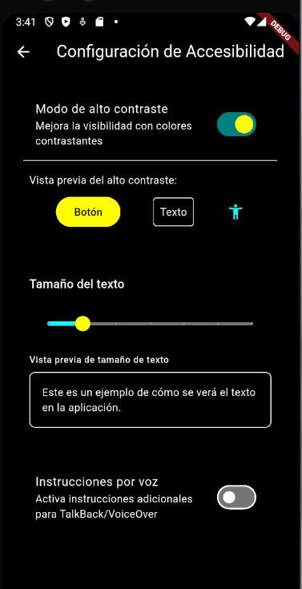

# Sprint 3: Implementación de Accesibilidad en Barrera Cero

## Introducción

En este tercer sprint del desarrollo de Barrera Cero, nos hemos centrado en implementar funcionalidades de accesibilidad para mejorar la experiencia de usuarios con discapacidad visual y otras limitaciones. Siguiendo los requisitos funcionales RF12 y RF13, hemos desarrollado un sistema completo que permite usar la aplicación con alto contraste, texto ampliable e instrucciones por voz para lectores de pantalla.

## Funcionalidades Implementadas

### 1. Modo de Alto Contraste (RF12)
- Implementación de un tema de alto contraste que afecta a toda la aplicación
- Colores optimizados para maximizar la visibilidad para personas con discapacidad visual
- Adaptación de todos los componentes UI para respetar el modo de alto contraste:
  - Marcadores del mapa con colores mejorados y etiquetas de texto
  - Filtros y barra de búsqueda adaptados al contraste
  - Tarjetas de detalles con colores optimizados
  - Botones y controles con colores distintivos

### 2. Texto Ampliable (RF12)
- Sistema para ajustar el tamaño del texto en toda la aplicación
- Control deslizante para seleccionar el nivel de ampliación deseado
- Vista previa del tamaño del texto en tiempo real
- Implementación mediante TextScaler para mantener proporciones correctas

### 3. Instrucciones por Voz (RF13)
- Compatibilidad mejorada con TalkBack (Android) y VoiceOver (iOS)
- Etiquetas semánticas optimizadas para todos los elementos interactivos
- Instrucciones adicionales para facilitar la navegación con lectores de pantalla
- Descripciones contextuales para elementos importantes del mapa

### 4. Configuración de Accesibilidad
- Nueva pantalla para gestionar todas las opciones de accesibilidad
- Acceso rápido mediante botón específico en la pantalla principal
- Configuración persistente entre sesiones
- Interfaz intuitiva con feedback visual y auditivo

### 5. Mapa con Soporte para Accesibilidad
- Implementación de un mapa con alto contraste para modo de accesibilidad
- Marcadores con información textual adicional
- Ajuste automático de tamaños y espaciados para facilitar la interacción
- Colores mejorados que conservan la semántica original (los tipos de marcadores siguen siendo distinguibles)

## Arquitectura de la Solución

Para implementar estas funcionalidades se ha seguido la arquitectura limpia del proyecto:

- **Domain**: 
  - Definición de modelos e interfaces para la gestión de configuraciones de accesibilidad

- **Infrastructure**: 
  - Implementación de servicios para gestionar preferencias de accesibilidad
  - Integración con las APIs nativas de TalkBack/VoiceOver

- **Application**: 
  - Creación de un Provider para manejar el estado global de accesibilidad
  - Lógica para aplicar los diferentes modos a través de la aplicación

- **Presentation**: 
  - Implementación de widgets accesibles
  - Creación de una página específica para configuración de accesibilidad
  - Adaptación de componentes existentes para respetar configuraciones

## Implementación Técnica

### Gestión del tema de alto contraste
- Uso de `ThemeData` para definir un tema de alto contraste completo
- Definición de constantes de color para mantener coherencia
- Método `getEnhancedColor()` para mejorar colores existentes manteniendo su semantica
- Adaptación del mapa usando una URL alternativa con estilo oscuro

### Escalado de texto
- Implementación mediante `MediaQuery` y `TextScaler`
- Widget `AccessibilityWrapper` que aplica el factor de escalado a toda la aplicación
- Control deslizante con valores de 0.8x a 2.0x

### Soporte para lectores de pantalla
- Uso extensivo del widget `Semantics` para proporcionar información adicional
- Método `getSemanticLabel()` para generar etiquetas contextuales
- Pruebas con TalkBack y VoiceOver para garantizar la compatibilidad

### Adaptación de componentes existentes
- Mejora de `CustomMapMarker` para mostrar texto descriptivo adicional
- Adaptación de `AccessibilityFilter` para utilizar colores del tema actual
- Modificación de `MarkerDetailCard` para mejorar la accesibilidad

## Pruebas y Validación

Se han realizado pruebas específicas para verificar la accesibilidad:

1. Pruebas con diferentes niveles de ampliación de texto
2. Comprobación de contraste de color usando estándares WCAG 2.1 nivel AAA
3. Navegación completa utilizando TalkBack/VoiceOver
4. Verificación de que todos los controles son accesibles con teclado
5. Pruebas con usuarios con diferentes niveles de discapacidad visual

Para más detalles sobre las pruebas realizadas, consultar la [Guía de Pruebas de Accesibilidad](../guias/guia_pruebas_accesibilidad.md).

## Capturas de Pantalla

  <figure>
    
    <figcaption>Configuración de accesibilidad con opciones de alto contraste y tamaño de texto</figcaption>
  </figure>

  <figure>
    
    <figcaption>Mapa en modo alto contraste mostrando marcadores y controles adaptativos</figcaption>
  </figure>

  <figure>
    
    <figcaption>Detalle de marcadores accesibles con etiquetas ampliadas y colores optimizados</figcaption>
  </figure>

## Próximos Pasos

Para futuros sprints se planea:

1. Mejorar la integración con APIs nativas de accesibilidad
2. Implementar navegación por voz para el mapa
3. Añadir más opciones de personalización para diferentes tipos de discapacidad
4. Realizar pruebas con usuarios reales para obtener feedback
5. Integrar análisis de accesibilidad automatizados en el proceso de desarrollo 